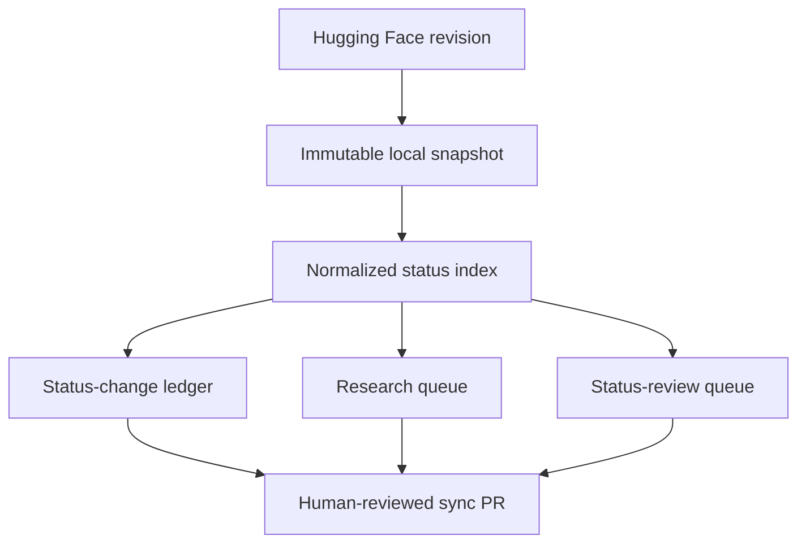

# Architecture

The first slice is a deterministic ingestion and prioritization pipeline. It
deliberately contains no autonomous proof agent and no mechanism for declaring
a problem solved.

## Boundaries

- `sources.py` is the only network-aware module. Network access is rejected
  unless the caller passes `--allow-network`.
- `snapshots.py` stores raw data under a content-addressed, immutable path.
- `normalization.py` converts schema-tolerant upstream JSON to a small typed
  record and marks every imported claim `UNVERIFIED_EXTERNAL_METADATA`.
- `sync.py` creates deterministic tracked artifacts and status diffs.
- `ranking.py` applies the versioned configuration in `config/ranking.toml` and
  emits score components and reasons.
- `validation.py` verifies hashes, counts, claim labels, and queue membership.

## Tracked versus local data

The full upstream JSON is large, changes frequently, and can contain text under
source-specific licensing. It remains in `.oplab/snapshots/` and is not
committed. The tracked index contains identifiers, titles, status/provenance
metadata, deterministic signals, and hashes. Full statements enter a future
research case only through an explicit immutable snapshot.

## Status model

There are three separate concepts:

1. **Imported status** — what the pinned upstream record says.
2. **Observed change** — a deterministic difference between two imports.
3. **Human assessment** — a future reviewer-owned conclusion backed by primary
   evidence.

Only the first two exist in this milestone. Neither is a verified mathematical
status.

## Failure behavior

- A mutable revision is resolved before data download.
- Existing snapshot bytes are never replaced.
- Invalid records fail the sync rather than silently disappearing.
- Generated tracked files are written through temporary files and atomically
  replaced.
- A failed scheduled run leaves the default branch unchanged.
