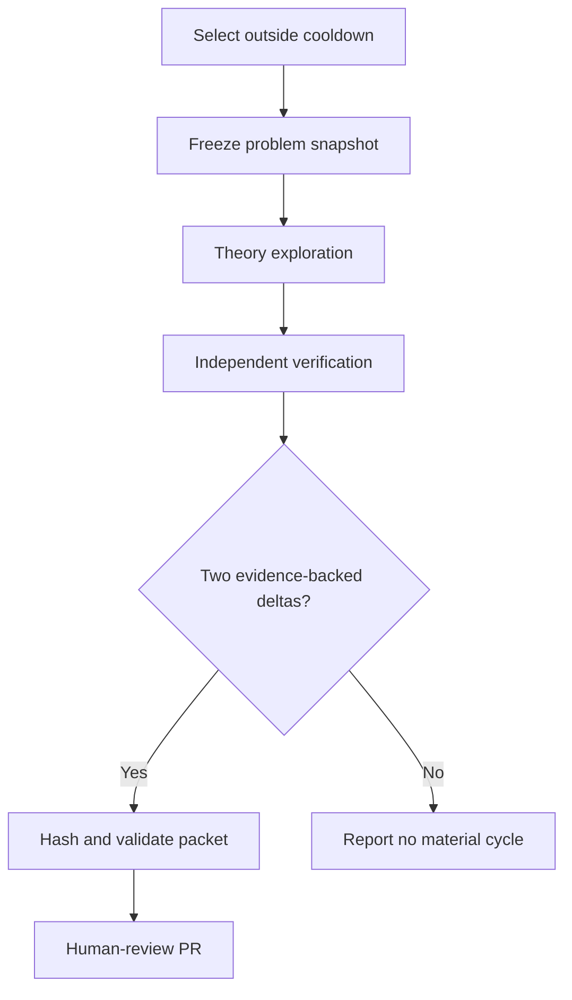

# Hourly breakthrough loop

The loop aims for compounding, falsifiable progress on narrowly scoped pieces of
open problems. It cannot guarantee a breakthrough. It can guarantee that every
accepted unit of progress is explicit, reproducible where applicable, and
paired with an independent attempt to disprove or verify it.

## Cycle order



## Selection

Use the research queue, not the status-review queue. Consider only the top 25
eligible records and apply a 24-hour per-problem cooldown. No problem may
receive more than two consecutive cycles. If the queue is unavailable, label
selection provisional and use a current official UnsolvedMath record with a
primary source; restoring the ranked queue remains an operational priority.

## Theory lane

Freeze a bounded target smaller than the parent problem. Record definitions,
quantifiers, assumptions, at least two approaches considered, falsification
targets, and typed claims. Change at least one evidentiary state: introduce a
falsifiable hypothesis, reduce an assumption, derive an equivalent formulation,
produce a reproducible experiment, or retire a line for a demonstrated reason.

## Verification lane

Begin from the frozen target and raw artifacts, not the theory conclusion.
Counterexample and boundary-case search comes first. Then check algebra,
quantifiers, citations, computational reproducibility, and formal artifacts as
applicable. Every verification check sets `independent_context: true` and links
to hashed evidence.

## Material-progress test

Accepted:

- a new counterexample with reproducible certificate;
- a hypothesis narrowed by a concrete failing family;
- a proof gap mapped to the exact unsupported dependency;
- a primary-source claim verified or contradicted;
- a deterministic experiment that distinguishes two approaches;
- a Lean-kernel-accepted sublemma, scoped only to that lemma;
- an infrastructure change that directly enables a previously blocked theory
  and verification step.

Rejected:

- paraphrasing prior notes;
- adding unsupported confidence;
- reporting more small cases as proof of a universal claim;
- repeating a failed search without a changed method or domain;
- labeling an imported or generated claim solved.

## Artifact layout

```text
cases/<problem-id>/cycles/<cycle-id>/
  cycle.json
  theory.md
  verification.md
  experiments/
  sources/
  formalization/
  manifest.json
```

`cycle.json` is validated by `oplab loop validate-cycle`. `manifest.json` is
generated only after all referenced artifact hashes match. The branch
`automation/hourly-research-loop` and its pull request remain human-review
surfaces; the loop never merges them.

## Stop and escalation conditions

Stop the current line and request human direction when the statement is
ambiguous, source rights are unclear, required primary evidence is unavailable,
or the same blocking objection persists for two cycles without a changed
method. Pause the overall loop if it cannot make honest progress in both lanes.
