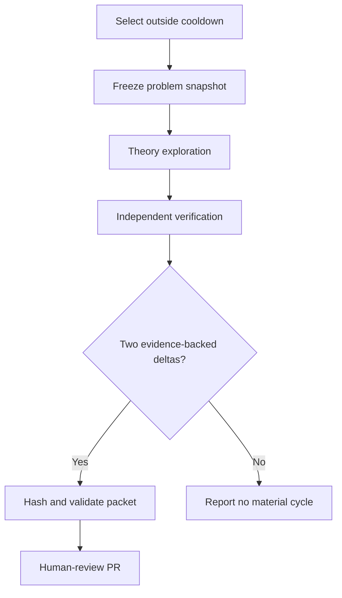

# Hourly breakthrough loop

The loop aims for compounding, falsifiable progress on narrowly scoped pieces of
open problems. It cannot guarantee a breakthrough. It can guarantee that every
accepted unit of progress is explicit, reproducible where applicable, and
paired with an independent attempt to disprove or verify it.

## Cycle order



## Selection

Use the research queue, not the status-review queue. Consider only the top 25
eligible records and apply a 24-hour per-problem cooldown. No problem may
receive more than two consecutive cycles. If the queue is unavailable, label
selection provisional and use only an unexpired candidate from
`config/first-run.json`; restoring the ranked queue remains an operational
priority. The launch-card order is not a score or research ranking.

Run `oplab loop preflight` before consuming the 45-minute research budget. The
gate succeeds only when the durable instructions are present and either a
ranked candidate is eligible or the pinned, short-lived launch fallback is
valid. The fallback expires instead of silently becoming stale.

## README work stack

The README contains a generated, marker-delimited dashboard with two views:

- **Current research stack** — problems with accepted cycles, ordered by the
  deterministic research queue when available and then by most recent progress;
  the table exposes the queue rank and marks active off-queue work as unranked;
- **Next up** — the highest-ranked candidates that currently clear cooldown and
  anti-thrashing gates, preserving their original queue ranks.

`oplab loop record-cycle` refreshes this dashboard after it records verified
history. A successful dataset sync also refreshes it, so queue changes and the
research branch remain reviewable together. `oplab loop update-readme --as-of
<timestamp>` is available for deterministic maintenance and tests. A missing
ranked queue is rendered as a provisional, explicitly unranked launch card with
the exact blocker; the loop never invents a backlog.

Blocked hours do not create README-only commits. The recurring loop continues
to retry synchronization and selection on future runs, but continuity never
overrides evidence requirements, cooldowns, rotation, or human review.

## Theory lane

Freeze a bounded target smaller than the parent problem. Record definitions,
quantifiers, assumptions, at least two approaches considered, falsification
targets, and typed claims with an origin and explicit falsification condition.
Change at least one evidentiary state: introduce a falsifiable hypothesis,
reduce an assumption, derive an equivalent formulation, produce a reproducible
experiment, or retire a line for a demonstrated reason.

## Verification lane

Begin from the frozen target and raw artifacts, not the theory conclusion.
Counterexample and boundary-case search comes first. Then check algebra,
quantifiers, citations, computational reproducibility, and formal artifacts as
applicable. Every verification check sets `independent_context: true` and links
to hashed evidence distinct from theory-lane evidence. It also records a method
family and a concrete independence basis; the label alone is not evidence of
independence.

## Material-progress test

Accepted:

- a new counterexample with reproducible certificate;
- a hypothesis narrowed by a concrete failing family;
- a proof gap mapped to the exact unsupported dependency;
- a primary-source claim verified or contradicted;
- a deterministic experiment that distinguishes two approaches;
- a Lean-kernel-accepted sublemma, scoped only to that lemma;
- an infrastructure change that directly enables a previously blocked theory
  and verification step.

Rejected:

- paraphrasing prior notes;
- adding unsupported confidence;
- reporting more small cases as proof of a universal claim;
- repeating a failed search without a changed method or domain;
- labeling an imported or generated claim solved.

## Artifact layout

```text
cases/<problem-id>/cycles/<cycle-id>/
  cycle.json
  theory.md
  verification.md
  experiments/
  sources/
  formalization/
  manifest.json
```

`cycle.json` is validated by `oplab loop validate-cycle`. `manifest.json` is
generated only after all referenced artifact hashes match and covers every file
in the packet, including executable experiments that are not direct claim
evidence. `oplab loop verify-manifest` must pass before history is updated. The branch
`automation/hourly-research-loop` and its pull request remain human-review
surfaces; the loop never merges them.

The schema-v2 `cycle.json` embeds a `frozen_problem` object containing the exact
statement and its hash, upstream revision and file hash, source URLs, imported
status claim, and selection basis. A cycle cannot silently drift to a revised
statement.

## Stop and escalation conditions

Stop the current line and request human direction when the statement is
ambiguous, source rights are unclear, required primary evidence is unavailable,
or the same blocking objection persists for two cycles without a changed
method. Retire or requeue that line and rotate to the next eligible candidate;
do not disable the recurring loop merely because one target is blocked. Pause
the overall loop only for a systemic safety or research-integrity failure.
